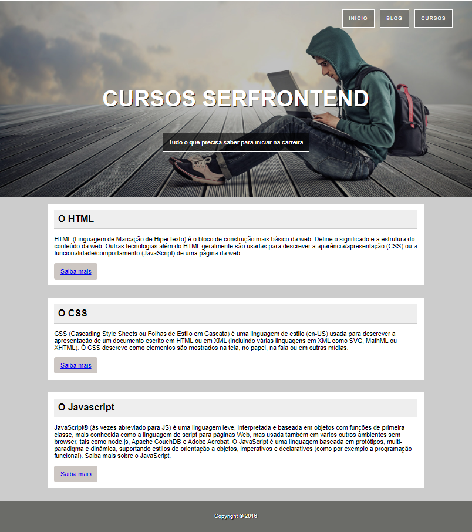

<h1>Udemy | Projeto HTML e CSS</h1> 

Página estilizada do desafio de projeto do curso de desenvolvimento Front-End da Udemy, nessa página encontramos algumas informações sobre HTML, CSS e Javascript.

<h2>Tecnologias utilizadas:</h2>
<ul>
  <li>HTML</li>
  <li>CSS</li>
</ul>

<h1>Como executar o projeto ?</h1>
<ol>
  <li>Clone o repositório do projeto.</li>
  <li>Abra o arquivo index.html no seu navegador.</li>
</ol>

